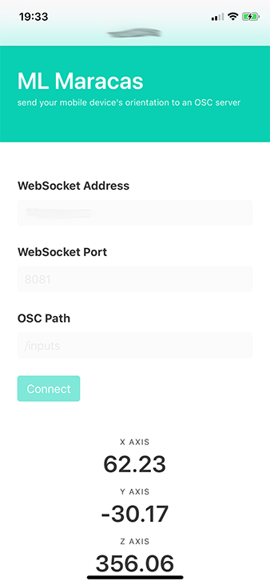

# Background

A simple Node Express application that uses WebSockets to send your browser's `deviceOrientation` value as OSC messages to a specified OSC remote path and port.



# Getting Started

## Running on a local machine

*note: devices should be on the same wifi network as the computer running the local server*

1. Clone the repo

2. Install dependencies

  ```shell
  npm install
  ```

3. Check (and if needed change) the UDP_PORT and WEB_SOCKET_PORT values in `app.js`

4. Start the server

  ```shell
  npm start
  ```

5. When the server is started, you will see a local network IP address, visit that address on port 3000 on the device you want to send its orientation values (e.g. `http://10.10.10.10:3000`)

6. Start moving!
