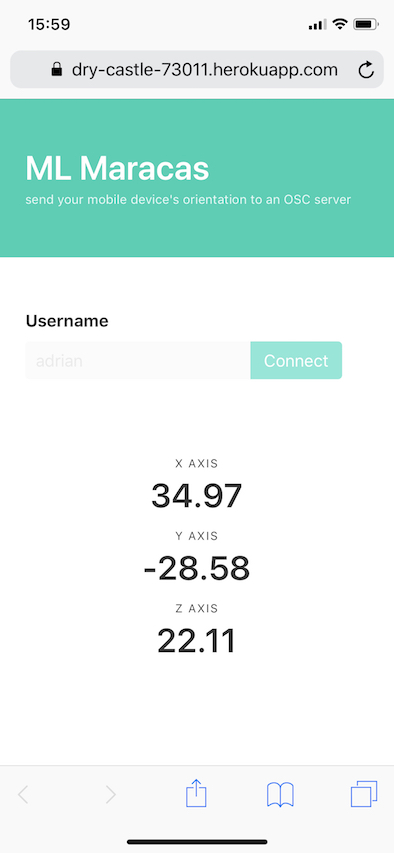

# Background

A simple Node.js Express application that allows users to send their browser's [`deviceOrientation`](https://developer.mozilla.org/en-US/docs/Web/API/Detecting_device_orientation) data using WebSockets. Other Websocket connected clients (e.g. an OpenFrameWorks application or Processing sketch) can then receive a collection of those orientation values for input use.

#### Try it out

[](https://heroku.com/deploy)

*The original version of this repository that forwarded the WebSocket data as OSC messages can be found on the [`osc-server` branch](https://github.com/adrianbautista/machine-maracas/tree/osc-server).*



# Getting Started

1. Clone the repo

2. Install dependencies

  ```shell
  npm install
  ```

3. Check (and if needed change) the UDP_PORT and WEB_SOCKET_PORT values in `app.js`

4. Start the server

  ```shell
  npm start
  ```

5. Visit the site on `localhost:3000` in your web browser (*note\*: the Firefox desktop browser has deprecated the deviceorientation sensor*)

6. Start moving!

## Variables

The interval at which the store of user device data is emitted back can be changed through an environment variable when starting the application:

```shell
USERS_INTERVAL=150 npm start
```

The interval at which a client (e.g. phone web browser) sends the orientation data to the server can be changed by changing the `DEVICE_INTERVAL` variable in `public/browser.js`.
